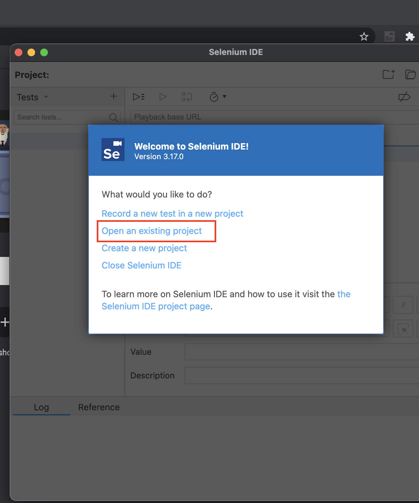
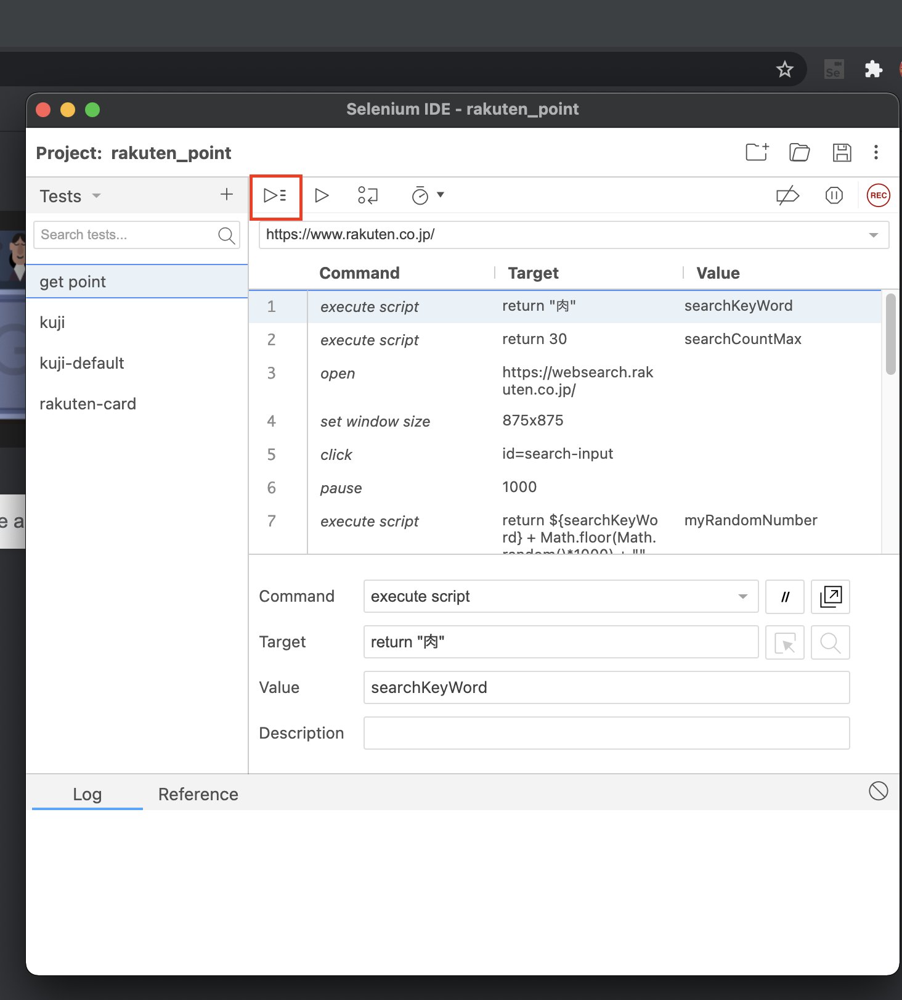

# How to Run
This is a step-by-step guide how to run the example:

1. Download chrome extensions
- [Rakute extension](https://toolbar.rakuten.co.jp/intro/install/chrome/)
- [Selenium Ide](https://chrome.google.com/webstore/detail/selenium-ide/mooikfkahbdckldjjndioackbalphokd)

2. Login rakuten pages: 
- [Rakuten](https://www.rakuten.co.jp/)
- [Rakuten card](https://www.rakuten-card.co.jp/e-navi/index.xhtml)

  At the Rakuten card page, after logging in, use the auto save password feature of Google chrome to automatically fill in the username and password each time you enter this page.

- [Rakuten websearch](https://websearch.rakuten.co.jp/Web?qt=test&col=OW)

- [Rakuten Kuji](https://kuji.rakuten.co.jp/256356cd1a)

  On this page if it is the first time login will require login.

3. Use Selenium Ide to Open an existing project with file rakuten_point.side, then Run all tests

