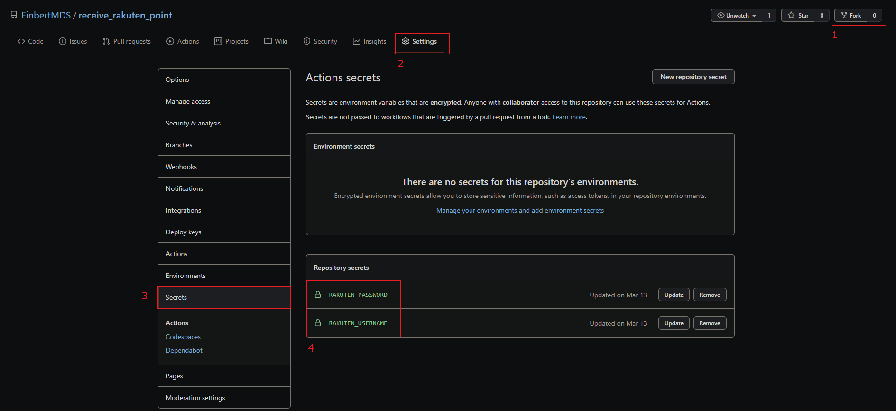
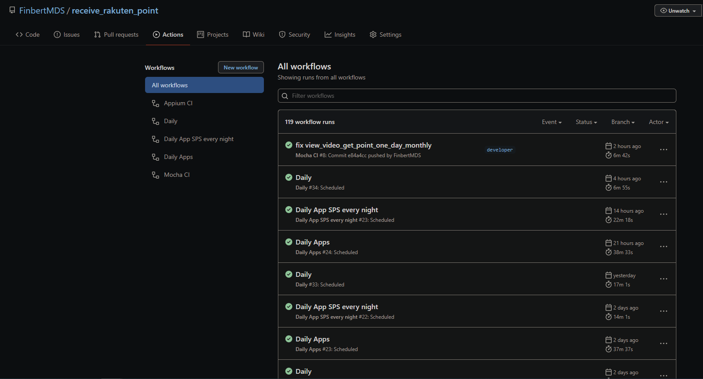

# Automatically receive daily points of Rakuten
[](https://github.com/FinbertMDS/receive_rakuten_point/actions/workflows/daily.yml)
[](https://github.com/FinbertMDS/receive_rakuten_point/actions/workflows/daily_apps.yml)
[](https://github.com/FinbertMDS/receive_rakuten_point/actions/workflows/daily_rakuten_sps.yml)
[](https://github.com/FinbertMDS/receive_rakuten_point/actions/workflows/daily_rakuten_kuji.yml)
## Technologies
- Selenium IDE

## How To Run
[How to run](HOW-TO-RUN.md) includes more details

## For Developer
If you want to automatically run every day to receive points of rakuten, you can start by forking the project and follow these steps run it with [Github Actions](https://github.com/features/actions)

1. Fork the project
2. Settings Rakuten username and password to Actions secrets

  ```
  RAKUTEN_USERNAME
  RAKUTEN_PASSWORD
  ```

  

3. View all runs from Github actions every day

  
